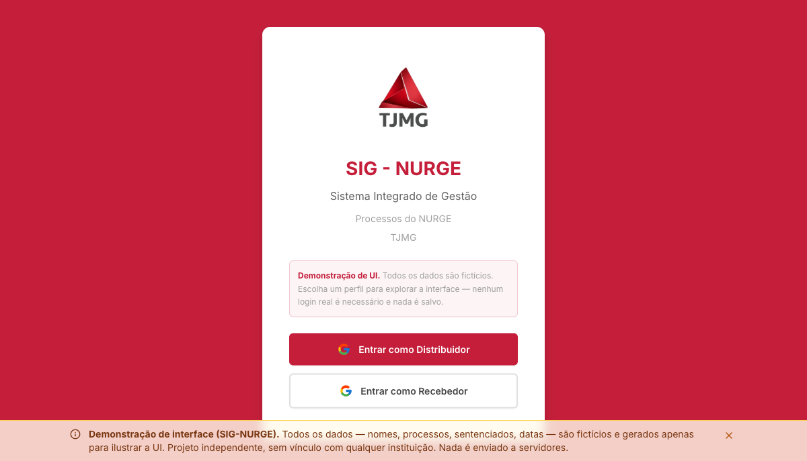
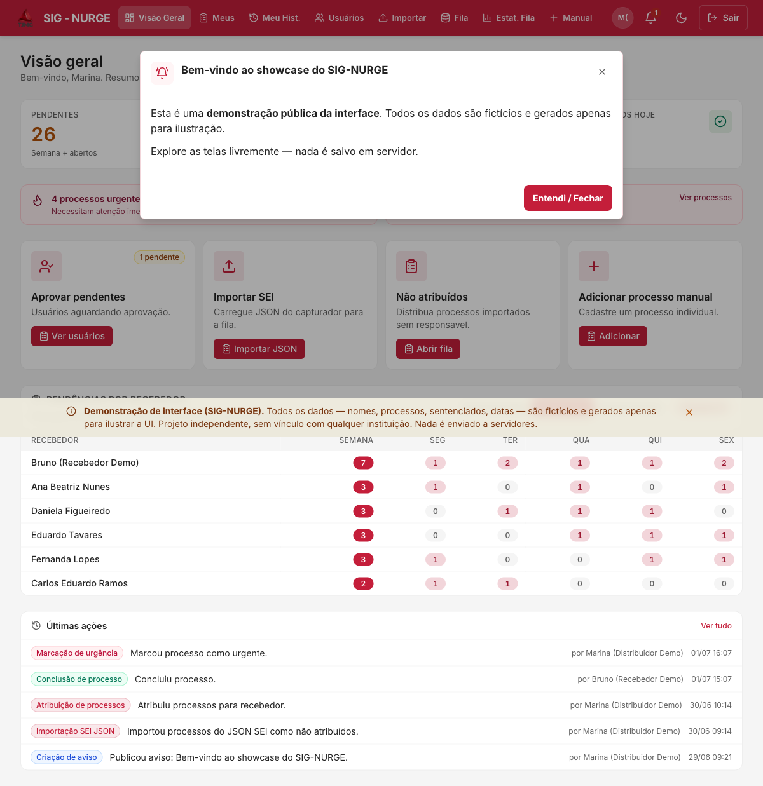
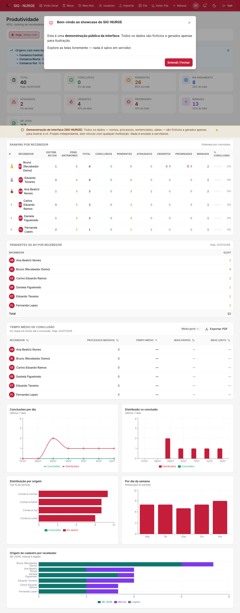
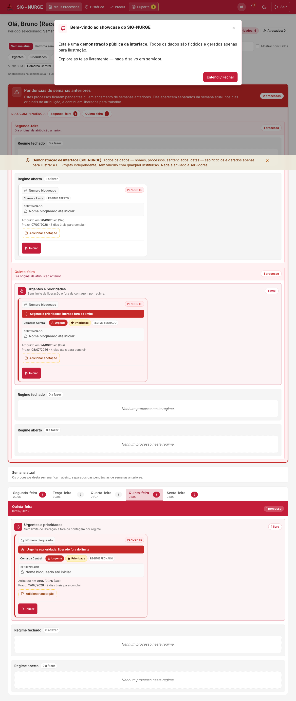

# SIG-NURGE — Showcase de UI

> ⚠️ **Demonstração de interface. Todos os dados são 100% fictícios.**
> Nomes, e-mails, números de processo, sentenciados, comarcas e datas foram
> **inventados** apenas para ilustrar a interface. Projeto **independente**, sem
> vínculo, endosso ou afiliação com qualquer instituição. Não há back-end: nada
> é enviado, salvo ou processado em servidores.

Vitrine **somente da interface** de um sistema de organização e distribuição de
processos. É uma versão pública e navegável, com o Firebase substituído por um
**banco de dados em memória** semeado com dados fictícios — dá para clicar,
navegar e explorar todas as telas sem login real e sem qualquer configuração.

## 🎭 Perfis de demonstração

Clone e rode localmente (ver abaixo). Na tela de entrada, escolha um perfil:

- **Distribuidor** — visão completa: importação, distribuição, não atribuídos,
  processos, coordenação, avisos, usuários, produtividade, histórico e
  configurações.
- **Recebedor** — a experiência de quem executa: "Meus processos", histórico e
  produtividade pessoal.

Nenhuma senha, nenhum Google, nenhum servidor. Recarregar a página reinicia os
dados.

## 🖼️ Telas

| Login (personas de demo) | Visão geral (Distribuidor) |
| --- | --- |
|  |  |

| Produtividade | Meus processos (Recebedor) |
| --- | --- |
|  |  |

## 💻 Rodando localmente

```bash
npm install
npm run dev
```

Depois abra o endereço que o Vite imprimir (normalmente
`http://localhost:5173/`).

Build de produção:

```bash
npm run build
npm run preview
```

## 🧱 Stack

- **React 18** + **TypeScript** + **Vite**
- **Tailwind CSS** (design system próprio)
- **React Router** (HashRouter — deep-links funcionam em qualquer host estático)
- **Zustand** (estado global) · **Recharts** (gráficos) · **lucide-react** (ícones)

## 🏗️ Como o showcase funciona

Toda a camada de dados fica atrás de um único "seam": `src/services/firebase/*`.
Nesta versão pública esses módulos foram reescritos para ler/escrever um banco
**em memória** (`src/mock/`) em vez do Firestore, mantendo exatamente as mesmas
assinaturas — por isso **nenhuma tela precisou ser alterada**.

- `src/mock/seed.ts` — dados fictícios (usuários, processos, avisos, chamados…).
- `src/mock/db.ts` — coleções reativas (imitam `onSnapshot` do Firestore).
- `src/services/firebase/*` — "serviços" que agora falam com o mock.
- `src/services/firebase/auth.ts` — autenticação simulada (personas de demo).

O pacote `firebase` permanece nas dependências apenas pela classe utilitária
`Timestamp` (100% offline); **nenhuma** conexão de rede, credencial ou projeto
Firebase é usada.

## 📄 Licença

[MIT](./LICENSE). Os dados de exemplo são fictícios e de domínio da demonstração.
